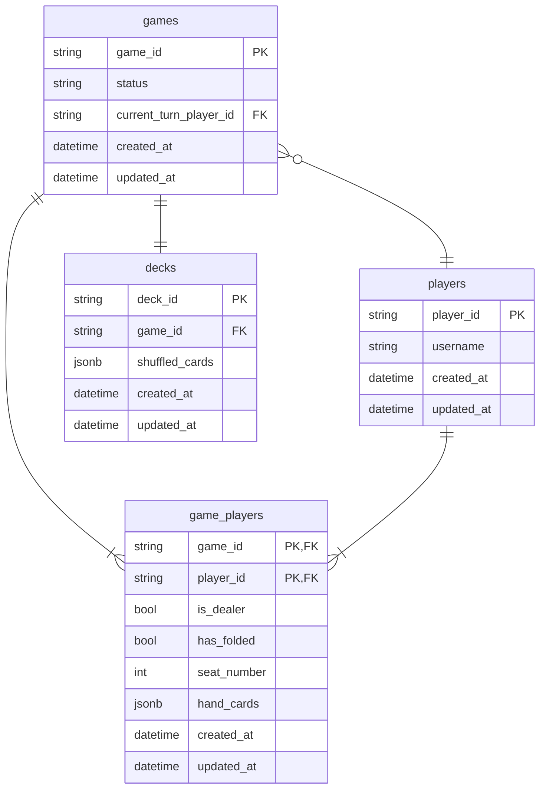

```mermaid
erDiagram
    games ||--|{ game_players : ""
    players ||--|{ game_players : ""
    games ||--|| decks : ""
    games }o--|| players : ""

    games {
        string game_id PK
        string status
        string current_turn_player_id FK
        datetime created_at
        datetime updated_at
    }

    players {
        string player_id PK
        string username
        datetime created_at
        datetime updated_at
    }

    game_players {
        string game_id PK,FK
        string player_id PK,FK
        bool is_dealer
        bool has_folded
        int seat_number
        jsonb hand_cards
        datetime created_at
        datetime updated_at
    }
    
    decks {
        string deck_id PK
        string game_id FK
        jsonb shuffled_cards
        datetime created_at
        datetime updated_at
    }
```