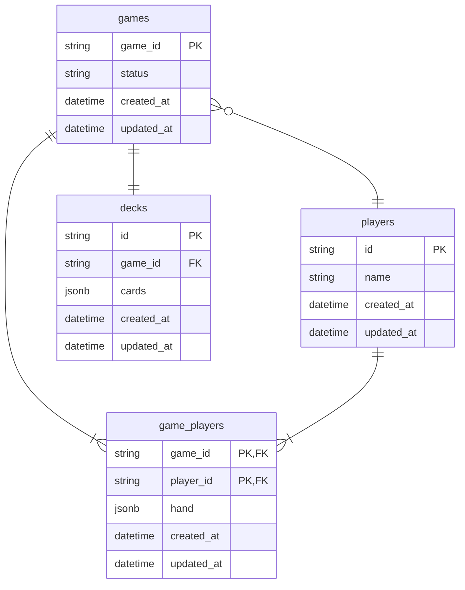

```mermaid
erDiagram
    games ||--|{ game_players : ""
    players ||--|{ game_players : ""
    games ||--|| decks : ""
    games }o--|| players : ""

    games {
        string game_id PK
        string status
        %% string current_turn_player_id FK
        datetime created_at
        datetime updated_at
    }

    players {
        string id PK
        string name
        datetime created_at
        datetime updated_at
    }

    game_players {
        string game_id PK,FK
        string player_id PK,FK
        %% bool is_dealer
        %% bool has_folded
        %% int seat_number
        jsonb hand
        datetime created_at
        datetime updated_at
    }
    
    decks {
        string id PK
        string game_id FK
        jsonb cards
        datetime created_at
        datetime updated_at
    }
```